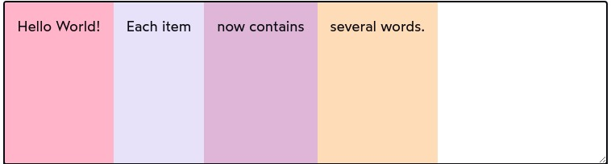
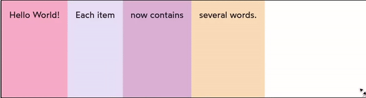
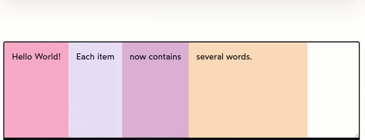
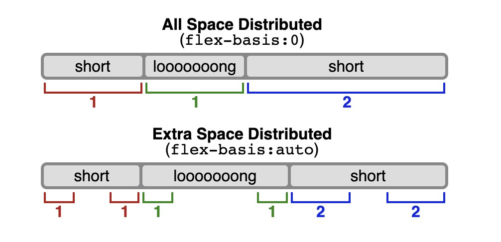

# Flexbox

A new layout mode!

By doing `display: flex;` on an element, we make it behave like a *block level* element, while also changing its children layout mode!

## Default Values

Flex containers gain a lot of functionalities that we can tweak. Before going into altering them, its important to understand its defaults!

When we give `display: flex;` to a container, here is the default values:

- *flex-direction*: **row**. Items will stack horizontally.
- *align-items*: **stretch**. Items will grow to fit in the secondary axis (think of height if direction is row, and width if direction is column)
- *justify-content*: **flex-start**. Items will stack from left to right (because default direction is row)

## Alignment Tricks

After learning flex-box, its common for most developers to kinda use the centering props (align-items and justify-content) to `center` all the time. THis can be ok most of the time, but there are cases its not the ideal go-to.

For example: a common piece of UI is a header with some logo, with some navigation links beside it. Because its almost certainly that the logo will be bigger than the nav items, aligning them to `center` might not reproduce the best visual effect.

Instead, a good approach is to align them based on their bottom! This could be achieved with `align-items: baseline`. And this works with multiple DOM levels inside!

> *Important:* the **text content** of the items is aligned.

> Safari detail: if using the baseline trick with a label/input combo, safari has a **bug** that does not align "as there would be text in the input" like other browsers. This can be worked around adding a placeholder to the input. If no placeholder is applicable, you can add an white space.

### Align self

We can use this property to align just the single flex child if we want!

But remember, this property aligns items to the **secondary** axis. There is **no** *justify-self* for a flex child!

### Chat interface

We can build a chat interface pretty easily with flex! Using `flex-direction: column` combined with `align-self: flex-end` to messages that the user has sent. The last thing is making sure you limit the size of the messages containers and done!

## Growing and Shrinking

The size of a flex child does NOT respect the usual constraints we see on layout mode.

At first, when we have a few children inside a flex container, **if there's enough space**, all the items will spam to be what the specification calls a *hypothetical size*. It's almost like `width: fit-content`. The item will spam to fill the entirety of the secondary axis as well.

Heres an example:



See how every item spams to fit their content and stops?

What happens if there's *no more space* left? (If we shrink the container).

- Nothing until there's still free space left to consume
- When no extra space is present, every item **shrinks** equally, **until it hits its minimum size**
- If we go even further all items with minimum size, the container will start to overflow

Here's an animated demonstration:



Here, the minimum content of each child is the size of the biggest word. (obviously, this example has some padding to look nicer)

### Width and Height effects

We've stablished flex children grow to its *hypothetical size* when enough space is available. What if we explicitly defined that size? Using `width` for *row* directions and `height` for *column* directions?

The result would depend on the extra space:

- **If theres enough space**: The element will grow to have its defined size
- **If theres NOT enough space**: The elements size will fit the available content, *not caring* about its defined size.

> Important: if we set `width` to a value **below** our min-content, the property *will* take effect, resulting in content overflow

This generally leads to confusion where an element is given a fixed size, but in reality, it doesn't respect it.

If we tweak the last child in the example about to have `width: 250px`, you'll see it only respects its size when there is available space:



See how the width is respected only when available space is there? The same rule applies for `height` when the direction is `column`.

### Defining a basis

Because flex children doesn't necessarily respect width, there is a more semantic property we can use to define our *base* for its size when there's enough space: `flex-basis`.

This property works similarly to `width` when *row* and to `height` when *column*. Kinda like a shorthand.

> But be aware! `flex-basis` **always** wins against `width` or `height`, when on **row** or **column**, respectively

So this declaration:

```css
.flex-child {
  flex-basis: 200px;
  width: 250px;
}
```

would result in a child with a *hypothetical size* of `200px`!

> flex-basis does NOT have an effect on a child's size if not enough space is available, unlike `width` that results in content overflow

### Growing

What if we want our child to grow to fill the available space?

For that behavior, we have `flex-grow`!

Ìf we do

```css
.flex-child {
  flex-grow: 1;
}
```

This will have 2 effects:

- **If theres enough space**: The element will grow to fit all the free space
- **If theres NOT enough space**: NOTHING happens. After all, there's no space to grow!

> flex-grow **overrides** flex-basis!

### Shrinking

If you take a look at the shrinking of elements above, when reducing the container's width, its possible to notice that all of the 4 elements kinda reduce in size proportionally. What if we wanted one of the elements to reduce first? Then we have `flex-shrink`

> How quick an item can shrink its hypothetical size

Defining:

```css
.flex-child {
  flex-shrink: 10;
}
```

Instructs our child to shrink *10 times* faster than the other elements. Just like growing, this property will have 2 effects:

- **If theres shrinking space** (we have not reached our min-content size yet): The element will shrink faster
- **If theres NO shrinking space** (we have reached our min-content size): NOTHING happens. After all, there's no space to shrink!


### Ratios

We use *unitless* values on `flex-shrink` and `flex-grow`. What do they mean?

They represent a **ratio** of the available space.

Check this example:

```html
<style>
  .row {
    display: flex;
  }

  nav,
  aside {
    flex-grow: 1;
  }

  main {
    flex-grow: 3;
  }
</style>

<div class="row">
  <nav></nav>
  <main></main>
  <aside></aside>
</div>
```

At this snippet, we want our `main` to consume 3 times more space than `nav` and `aside`.

So how much space will they each get?

Simply add them together to determine the percentages of space:

1 + 1 + 3 = 5

3/5 = 60%
1/5 = 20%

So `main` gets 60% of the free space, while the other two get 20% each.

The SAME idea goes for shrinking:

If we have two elements, one with `flex-shrink: 1` and the other with `flex-shrink: 3`, every *4 pixels* of total shrinking corresponds to 1px of the first element and 3px of the later one

### Flex shorthand

We can use a shorthand `flex: 1` to default to

```css
.flex.shorthand {
  /* In this order! */
  flex-grow: 1;
  flex-shrink: 1;
  flex-basis: 0;
}
```

This instructs our child to get the available space to determine its actual size. If we have multiple elements, and give them all `flex: 1`, we are essentially saying to them to *occupy the same amount of space*!

Here's the difference:



## Constraints

We can use min and max values to clamp our width/height values as well as setting the flex properties to have more power over the stretching and shrinking of our elements.

## Shorthand Gotchas

When going through `flex-basis`, `width` and the *hypothetical size* we verified one really important mechanic:

**flex-basis _always_ wins against width**

This is REALLY important, because it can mess up the sizing of your layout if not aware.

This comes in play in situations like this:

```css
.content-to-grow {
  flex: 1;
  width: 300px;
}
```

Lets say our element is in a shrink situation: Its *hypothetical size* here is **0px**! It will shrink in reference to that!!

## Wrapping

Just like `inline` elements, flex children can *line wrap* using a property called `flex-wrap`.

We can control how our children will be spaced inside our container and juggle between `flex-basis` and `flex-wrap` to make sure we don't have unwanted overflow! At the moment our container would overflow, it line wraps!

> *Important*: When in line-wrap scenarios, the size of each child and their alignment play an important role on the disposition. Be aware!

## Groups and Gaps

1. `margin-left: auto` (or right) can be used to push elements to the other side (when on *row*, top/bottom on *column*)

2. You can set the flex container `gap` to a specify the amount of space between the children

```css
.container {
  display: flex;
  gap: 8px;
}
```

And it only works in between items, not for the edges!

> the gap property is relatively new, being present only on really recent versions of the browsers (especially on Safari). This can lead to inconsistencies in design for the users accessing your content from older versions.

3. You can solve the `gap` issue by using a *spacer* component.

Example in styled-components:

```js
const spacer = styled.div`
  min-width: ${props => props.$space}px;
`
```

- Here we use `min-width` because we don't want our space to shrink on smaller screens!
- You could use the `margin` property but remember to add a `min-width: 0.1px` or something to prevent *margin collapse*.


## Ordering

By default, flex children are arranged according to the DOM order. We have an child property that can do this! `order`.

It receives a numeric value. Items are arranged from small to large value. If there's a tie, DOM order takes place.

BUT! Thats not all to it. We can use `flex-direction` as well, combined with `row-reverse` or `column-reverse` values!

> Using `flex-direction` also changes the default alignment (from left to right on row, for example). If we want to keep the left alignment, we could use `justify-content: flex-end` as well!
