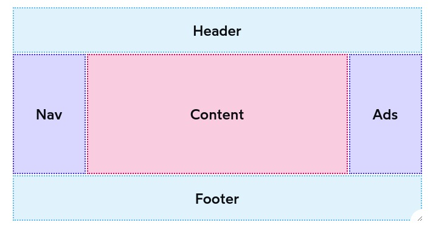

# Common Layouts Examples

## Holy Grail Layout

For a while, this layout was all over the internet.

Here it is:



This layout is extremely hard to make right with old layout modes, but flexbox makes it easy enough.

Here's a full example:

```html
<style>
  /* cometic/resets */
  .box {
    border: 3px solid;
    padding: 16px;
  }

  header.box {
    border-color: hsl(45deg 100% 50%);
    background-color: hsl(45deg 100% 50% / 0.2);
  }
  nav.box {
    border-color: hsl(170deg 100% 35%);
    background-color: hsl(170deg 100% 35% / 0.2);
  }
  main.box {
    border-color: hsl(220deg 100% 50%);
    background-color: hsl(220deg 100% 50% / 0.2);
  }
  aside.box {
    border-color: hsl(300deg 100% 45%);
    background-color: hsl(300deg 100% 45% / 0.2);
  }
  footer.box {
    border-color: hsl(350deg 100% 60%);
    background-color: hsl(350deg 100% 60% / 0.2);
  }

  body {
    padding: 0;
  }

  * {
    box-sizing: border-box;
  }

  /* solution */
  html, body {
    height: 100%;
  }

  .wrapper {
    min-height: 100%;
    display: flex;
    flex-direction: column;
  }

  .middle {
    display: flex;
    flex: 1;
  }

  nav.box, aside.box {
    flex: 1;
    max-width: 250px;
  }

  main.box {
    flex: 3;
  }

  footer {
    margin-top: auto;
  }
</style>

<div class="wrapper">
  <header class="box">Header</header>
  <section class="middle">
    <nav class="box">Nav</nav>
    <main class="box">Main Content</main>
    <aside class="box">Ad unit</aside>
  </section>
  <footer class="box">Footer</footer>
</div>
```
And whats really important: with this, we make sure our footer is at the bottom,no matter what!


## Sticky Sidebar

Another common layout is having a side bar sticking as we scroll down the page. Can we make this with flexbox?

At first, it seems that we **cant** make it work. Take a look a this snippet:

```html
<style>
  body {
  padding: 0;
  }

  * {
    box-sizing: border-box;
  }

  nav, main {
    padding: 16px;
  }

  img {
    display: block;
    width: 300px;
    margin: 16px 0 64px;
  }
  .wrapper {
    display: flex;
  }

  nav {
    position: sticky;
    top: 0;
  }

  main {
    flex: 1;
  }
</style>

<section class="wrapper">
  <nav class="box">
    <h2>Navigation</h2>
    <ul>
      <li>Section One</li>
      <li>Section Two</li>
    </ul>
  </nav>
  <main class="box">
    <p>This container contains random stuff to increase its height.</p>
    
    <p>Normally, a blog post would exist in this container.</p>
    
    <p>This container contains random stuff to increase its height.</p>
    
    <p>Normally, a blog post would exist in this container.</p>
    
  </main>
</section>
```

Run this code and check it out. It appears to not work, right?

Or is it?

One core thing we need to remember with flexbox: the default value of `align-items` is `stretch`. This makes our children grow the secondary axis (in this case, their height), to the entire container.

If the child is the size of the whole container, when we scroll, we are actually scrolling through it! So it can be sticked as its still present on screen.

Try adding `height: fit-content` to our `nav` and check again if it works. Voila!!

Or even `Align-self: flex-start`;

