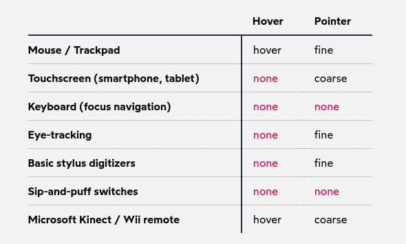

# Media Queries

The primary tool for responsive websites!

Media queries integrates CSS' `at-functions`, like `@keyframes` for animations. The syntax goes like this:

```css
@media (max-width: 500px) {
  /* some CSS */
}
```

The css declarations inside the media query will only take an effect if the screen width has less than `500px`. Its also possible to use `min-width`, which is the exact opposite.

These declarations are **added** to the existing declarations, and follow the same CSS specificity rules, as in:

```css
@media (max-width: 500px) {
  .login-btn {
    color: red;
  }
}

.login-btn {
  color: green;
}
```

The login button described above would *never* have a red color, as the green declaration comes after.

## Styled Components Localized Usage

Media query declarations are usually all put together at one place on websites. This could lead to a lot of confusion trying to find each one of them to determine the pattern of style being applied on each breakpoint. With styled components (and other pre-processors like Sass), tho, we can localize each query inside each component that should be affected by it:

```js
const Title = styled.h2`
  font-size: 2rem;

  @media (min-width: 550px) {
    font-size: 2.5rem;
  }

  @media (min-width: 1100px) {
    font-size: 3rem;
  }
`;
```

Making it really easy to spot what's going on and, better, to make precise, faster, modifications. If you have access to this, make sure to use it!

## Mobile-first x Desktop-first

It comes down to which application you are developing. It can be right to use either of them, but please make sure to stick with one for the whole app once decided. Having min and max queries all over the application makes it harder to understand properly how the interface is being constraint.

Obviously, you should use your discretion with this. If there's a really specific style to be applied only on, say, tablets, it should be ok to use declarations like


```css
@media (min-width: 500px) and (max-width: 1023px) {
  /* css here */
}
```

As it should be more clear than doing it with only min or max queries. It is possible, but it increases the readability to a point it might not be worth it.

# Other Queries

There's more to media queries than width!

## Hover queries

When Apple created iOS Safari, they decided that tapping on an interactive element (like a link or button) should trigger the hover state. This is a questionable decision nowadays, but it made sense at the time—web developers at the time assumed that everyone could hover, since smartphones weren't a thing yet. It was common for tooltips to only be shown on hover.

Android devices work the same way. Tapping an interactive element will show the "hover" state. It'll stay hovered until you tap somewhere else.

This could lead to problems when interacting with some states. How to properly define a hover style, then?

There's a relatively [new](https://drafts.csswg.org/mediaqueries-4/#mf-interaction) query we can use:

```css
@media (hover: hover) and (pointer: fine) {
  button:hover {
    text-decoration: underline;
  }
}
```

"What's the difference between "hover" and "pointer"? They actually refer to two distinct capabilities. hover is the ability for a device to move the cursor without also triggering a click/tap on the element underneath; a mouse can do this, but your finger or a stylus can't. pointer refers to the level of control the user has over the position of the cursor";

Here's how each cursor-like interacts with it:



> The 'and' keyword used above works just like any other logical 'and' you've seen before

Here's another common example:

```css
@media screen and (min-width: 600px) {
  /* styles */
}

```

> screen is a “media type”. In this case, we're saying that the styles should only apply when displaying the site/app on a screen. We can also specify print styles which apply when the page is printed onto paper or saved as a PDF.

We can also specify a media query that *any* of the conditions should match:

```css
@media (max-width: 600px), (min-width: 800px) {
  /* styles */
}
```

## Preference Based queries

We can apply some styles based on user preference! For example, dark mode:

```css
@media (prefers-color-scheme: dark) {
  /* Dark-mode styles here */
}
```

But, more importantly, we can use animations only if the user hasn't disabled them:

```css
@media (prefers-reduced-motion: no-preference) {
  /* Animations here */
}
```

## Breakpoints

Its important to choose breakpoints that make sense to the devices each one will handle. One note, tho:

Picking breakpoints in PX is the most standard practice, but in reality we should be doing it in `rem`. Why? Because the user can change it's default font size! If he does that, things mike get way too big to fit the pixel chosen breakpoint!

But using rem is not as intuitive as pixels. Thats why we can use JS to make the make for us:

```js
const BREAKPOINTS = {
  tabletMin: 550,
  laptopMin: 1100,
  desktopMin: 1500,
}

const QUERIES = {
  'tabletAndUp': `(min-width: ${BREAKPOINTS.tabletMin / 16}rem)`,
  'laptopAndUp': `(min-width: ${BREAKPOINTS.laptopMin / 16}rem)`,
  'desktopAndUp': `(min-width: ${BREAKPOINTS.desktopMin / 16}rem)`,
}
```

Why use `16` there, if the user could set his font size to, say, 24?

> The rem unit will do the math for us. If the user's font size is 16px, 34.375rem will equal 550px. If they crank it up to 24px, though, that same 34.375rem will now equal 825px.


