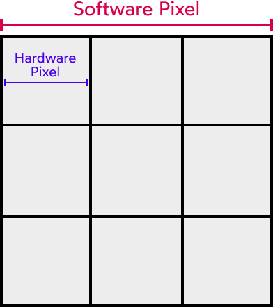

# Responsiveness

Back in the early days of the web, most websites were built to fit on pre-defined desktop screens. Because of this, a lot of early days websites were made with pixel measures all over the place. It was the standard procedure.

After the introduction of several screen sizes (iphones, ipads, laptops...) that can all view these webpages, a new way of designing and creating them was required.

At first, developers were creating mobile-only websites. Facebook would redirect to m.facebook.com when on a mobile device,for instance. But maintaining 2 code bases is far from ideal.

Thankfully, CSS (and, well, js) can help us build adaptive interfaces to all these different screen sizes.

Before we jump into that, a few considerations need to be made:

## Mobile Quirks

Almost every mobile phone nowadays has a "High Density" screen. This means the pixel density on the screen is different than the 1:1 we have on PC.

The iPhone 12 has a native resolution of 2532×1170 pixels, this is more than most large desktop monitors!

We can access the "device pixel ration" with JS:

```js
console.log(window.devicePixelRatio);
```

The number we get from this is the ration between "in-device" pixels to the actual "theoretical" pixels we use in CSS.

On an Iphone, for instance, this number can be equal to `3`. This means a declaration of `10px` in CSS translates to `30px` on that iphone.



This translation happens under the hood. Writing `width: 10px` will actually dray a `width: 30px` on that iphone!

> This is especially important when treating images. Later this will be addressed more carefully

## The "magical" meta tag

After the introduction of smartphones, a new `meta` tag was created to make sure we render pages correctly on them:

```html
<meta
  name="viewport"
  content="width=device-width, initial-scale=1"
>
```

This tag comes on most templates you can find, even `create-react-app` has it.

It was created to disable some "optimizations" the browser would make on mobile devices. For instance, when the Iphone was released, Safari would render a website as it was on a screen width of 980px, only to then scale it down to 320px. This created a huge page, in which users could pinch-zoom to the content they wanted.

This behavior might has been considered ok back then, but not anymore.

> `width=device-width` instructs the browser to set the viewport width to match the device's width (so, 320px instead of 980px). initial-scale=1 says that we should start at 1x zoom.

## Mobile testing

Having a physical device is always a great way of spotting bugs on your interface. But thats not an option for everybody!

Whats more accessible, tho, is trying to measure the experience on both a high-end and low-end smartphone, to see if the phone's power messes with your application.

[Browser Stack](https://www.browserstack.com/) is also an awesome tool to have access to different experiences, although it might lag a bit. But again, not a cheap option.

## Local Development Tools

Its not as easy to test and debug on mobile devices. We need to connect to `localhost` from the device, and yet, somehow access the browser's tools from our desktop computer.

### Accessing localhost

Use a service like [ngrok](https://ngrok.com/)

It can be installed globally with NPM, and then simply run

```bash
ngrok http 3000
```

This will generate a URL directly to your localhost.

### Remote Debugging

#### IOS

1. on device debugging: For IOS users, there's a browser that comes with dev tools [here](https://apps.apple.com/us/app/inspect-browser/id1203594958#?platform=iphone). It costs $ tho!

2. remote debugging:

For IOS, if you have a mac OS you can use the official integration to debug ([here](https://webkit.org/web-inspector/enabling-web-inspector/#ios-device))

> Google Chrome on iOS? No need! On iphones, all browsers are secretly safari: "Google Chrome on iOS uses a WebView that defers all page-rendering to iOS Safari. In other words, iOS Chrome isn't actually a discrete browser; it's more like a Chrome-scented skin for Safari."

For windows users, the safari debugging isn't available. For that, there is a tool called [inspect](https://inspect.dev/). It is paid, tho!

For linux, there's no standard free or paid tool to debug on IOS.

#### Android

You can check the up-to-date methods [here](https://developer.chrome.com/docs/devtools/remote-debugging/)


