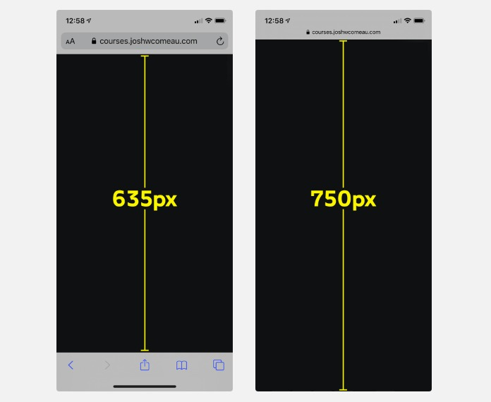

# Viewport units

One interesting about CSS: it has types!

> Every value that you might think to use, like 24px or 10% or #FF0000, has a type. It might be a <length> or a <color> or an <angle>, or one of [many other possible types.](https://developer.mozilla.org/en-US/docs/Web/CSS/CSS_Types)

The `<length>` type is the most common, and it contains a lot of different units (like px, rem, ch...)

It also contains *viewport units*.

We have two main viewport units:

- vw (viewport width)
- vh (viewport height)

```
1vw = 1% of the viewport width
```

Most people use them on width and height declarations, but they can be used on *any* declaration that accepts a `<length>` value.

## Problems

### The mobile height height

One common use for the `vh` unit is to make sure the page fits the entire available height (or at minimum, that). It works wonders on desktop, but fails on mobile.

The reasoning for that is: mobile phones have an "expanded" browser UI, that eats up space when its triggered:



On the first implementations of the Iphone, it actually automatically updated to the new height, but that caused a lot of websites to "jump" in size and lead to this being reverted.

What happens today is: **vh referes to the largest possible height**.

Because of this, websites with `height: 100vh` gain a scrollbar on mobile, while having none on desktop. [Live example](courses.joshwcomeau.com/demos/full-height-vh)

For this, we have a few possible solutions:

1. We can use a JS-based solution to change how the vh unit works. The most popular solution is [viewport-units-buggyfill](https://github.com/rodneyrehm/viewport-units-buggyfill). Its not recommended unless you really need the vh unit to work. Even if it works perfectly today, it could break when browsers update (and imagine how hard it would be to trace that bug!)

2. We can use the percent-based trick we learned in [Module 1](../01_Rendering_Logic/width-height.md), passing percentages down so that they can be used where you need them.

3. We can tweak our designs so that they don't need to fill the viewport exactly. Fixed-height designs tend to be rigid and flaky; better to have a fluid design that doesn't have such a strict height requirement.

### Desktop scrollbar issue

While the `vh` has its problems on mobile, `vw` has it on desktop.

If we assign `width: 100vw` to an element in a page *that has a scrollbar*, the page will gain a **horizontal scroll**

Why? Because `100vw` **does not account for the scrollbar width**. [Example here](https://courses.joshwcomeau.com/demos/100vw)

To fix this issue, we can use a little bit of javascript:

```js
const scrollbarWidth = window.innerWidth - document.documentElement.clientWidth;
```

To use it to your advantage, define it as a variable:

```js
document.documentElement.style.setProperty(
  '--scrollbar-width',
  scrollbarWidth + 'px'
);
```

And then use it as:

```css
html {
  --full-width: calc(100vw - var(--scrollbar-width));
}
.wrapper {
  width: var(--full-width);
}
```

> In React you could use it on a *useEffect* hook up on your app!

Something to be aware, tho: If our page initially has no scrollbar, but gains it later, this operation will be mismatched.

We can "fix" this issue by setting a scrollbar to begin with:

```css
body {
  overflow-y: scroll;
}
```

## vmin & vmax

There are two more nifty viewport units: vmin and vmax.

vmin will refer to the shorter dimension, while vmax refers to the longer one. On a portrait phone, 50vmin is equivalent to 50vw, but on a landscape monitor, 50vmin would be equal to 50vh.

Not a whole of practical usage, tho. Just to know they are there.
